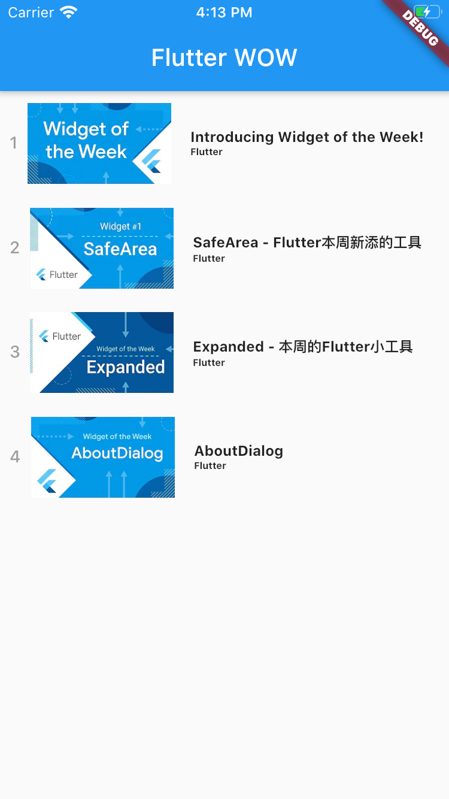
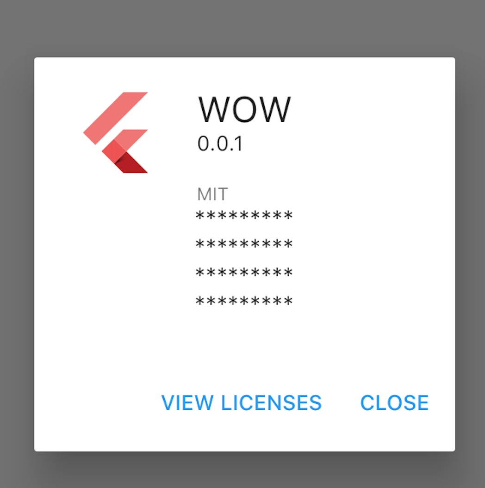

# Fltter WOW - Flutter widget of the week

每个Flutter构建的应用都使用了许多核心的widget，如滚动、导航、图标和字体等，尽快的熟悉这些widget是迈向flutter大门的关键一步，为此谷歌创建了每周一widget的系列短片帮助大家，本项目是配合该系列短片提供一些简单使用的示例代码，为此代码力求简单实用，易懂易用，希望大家喜欢，关于更新进度，本人力求至少每天更新一个，直到追上谷歌的步伐。

## Main Page

## AboutDialog

